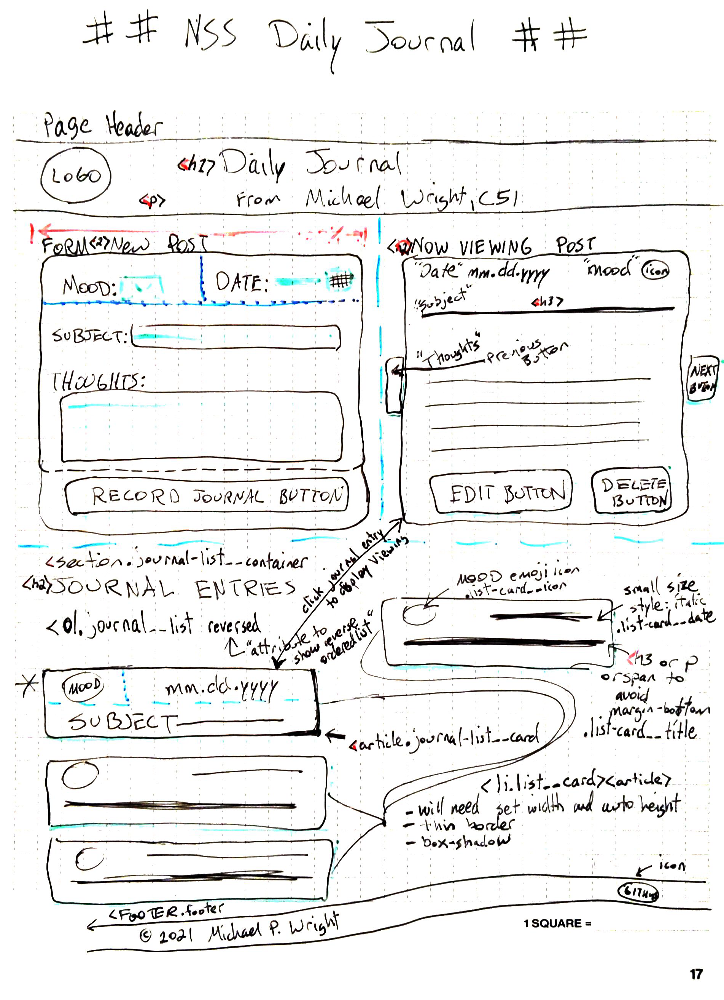
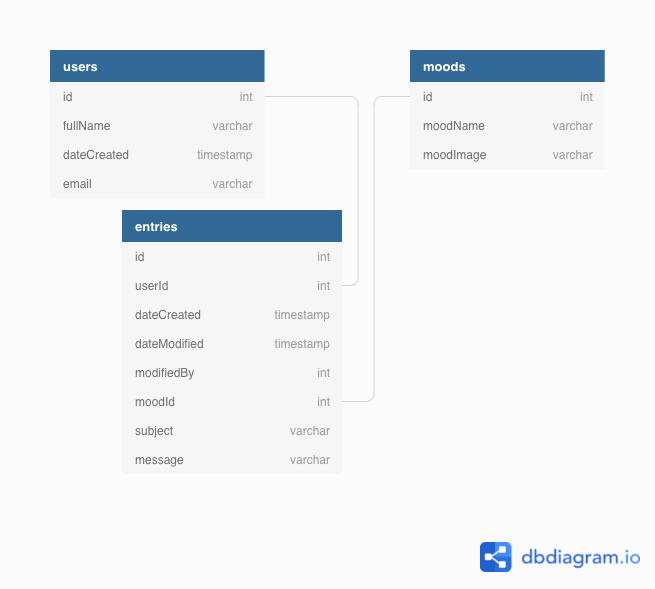

# nss-daily-journal Michael Wright, C51

## Wireframe: Here's what I'm thinking for the layout
*I used a Rocketbook pad with grids.*

*Specs: Rocketbook Matrix 8.5' x 11 in, .0.25 in by 0.25 in Grid*

## Entity Relationship Diagram (ERD)

## Notes for me on upcoming actions
Reference for Practice items: https://github.com/nss-day-cohort-51/client-side-mastery/blob/main/book-2-giffygram/chapters/47-GG-Login-Register.md